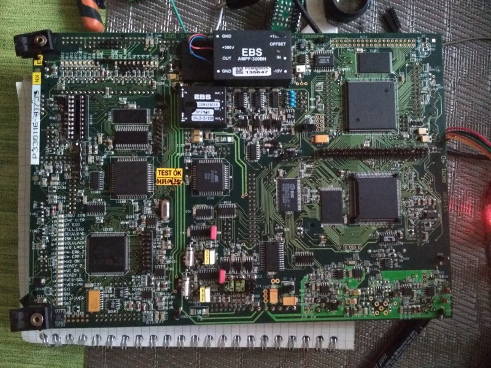
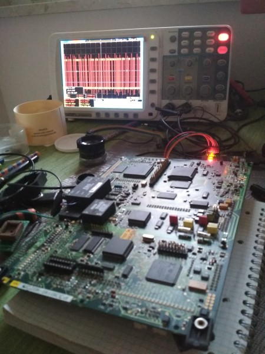
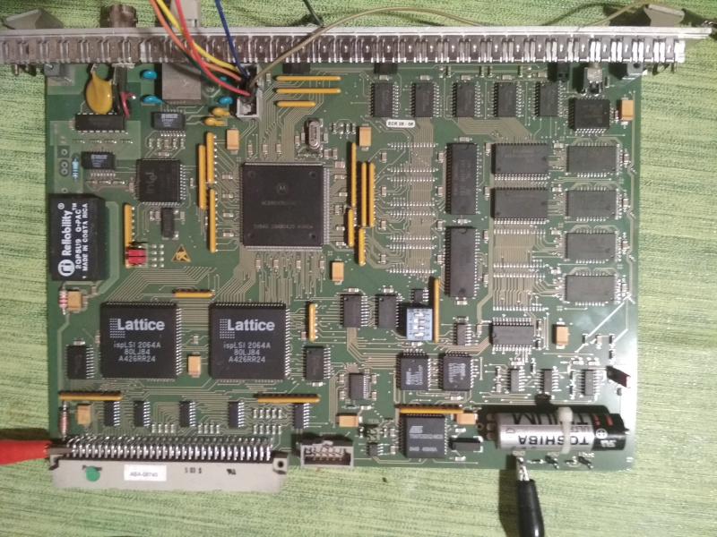

# Talking to BDM using STM32 bluepill as Altera UsbBlaster

Some time ago I bought a scrap PCB board to reuse some of the components on it. It's a cheap way to obtain parts that are either expensive or simply obsolete and unobtainable. The board turned out to ba a printer controll unit.

It included couple of components that could possibly be reused:
- Freescale [MC68332](https://www.nxp.com/docs/en/user-guide/MC68332UM.pdf): 32 bit microprocessor utilizing MC68000 architecture;
- Freescale [MC68HC11](https://en.wikipedia.org/wiki/Motorola_68HC11): 8 bit microcontroller;
- Atmel [AT89S53](http://ww1.microchip.com/downloads/en/devicedoc/doc0787.pdf): Good old [80C51](https://en.wikipedia.org/wiki/Intel_8051) compatible microcontroller. Might eventually be useful;
- Xylinx [Spartan XCS20](https://www.digchip.com/datasheets/parts/datasheet/534/XCS20-pdf.php): An FPGA. I might prove useful, but I have no experience in programming Xylinx devices. Also the part is dated and I had no success in finding compatible software;
- Xylinx [XCR3128XL](https://www.xilinx.com/support/documentation/data_sheets/ds016.pdf): CoolRunner CPLD. As above, but I think that there is software able to talk to this chip;
- Assortment of ROM, RAM, couple of DACs, an RTC and the usuall analog and digital glue components.

Overall the board powers on, throws some errors (due to missing power rails) and I can see activity on digital pins on the scope.

I had some previous experience with scrap PCBs by using JTAG to be able to dump ROMs and play with the boards by reprogramming them. Due to lack od JTAG on the MC68332 processor I was ready to abandon thinking that I would ever be able to hack this board.

Until recently I had this idea to use my STM32 acting as Altera UsbBlaster to bitbang the BDM interface.



## STM32 as Altera UsbBlaster

I successfully used the STM32 bluepill acting as Altera UsbBlaster to program Altera CPLDs, to interface JTAG using UrJTAG and for overall development. I used one of the popular builds (e.g. see [here](https://github.com/Icenowy/USB-Blaster-GCC)). I just made sure to change bluepill pins to 5V compatible ones in the source.

Using UsbBlaster has the advantage that the protocol is known and it can be used for serial write and read or to bitbang using USB. I had some success before with programming obsolete Altera FPGAs from Python.

## BDM

The BDM (Background Debugging Mode) is a propriety interface used in the Freescale family of ICs. A great description focusing on the CPU32 core can be found [here](https://cmp.felk.cvut.cz/~pisa/m683xx/bdm_driver.html#tth_sEc1). 

In short it is also a synchronous serial interface, where the commands are transferred as 16 bit words with 1 additional starting bit, which has to be cleared when sending to target.

Some of BDM pins serve dual purpose. Once in normal mode they can be used to track the instruction pipe. Moreover the CLK pin serves as breakpoint input to the target. This dual functionality results in the need to apply some simple glue logic to the BDM probe to be able to single-step the target during debug. 

For simplicity I don't add any more ICs to STM32 board. I cannot do single-step debuging on the target, but I can live with this.

The final connections are the following:

```
JTAG    BDM
TDI <-- IFETCH/DSI
TDO --> IPIPE/DSO
TCK --> BKPT/DSCLK
TMS --> RESET
```

To write commands I use bit banging in the Blaster. For readout I use a mix of bit banging and passive serial mode.

To enter BDM mode I pull down the RESET(TMS) and TCK pins and release only the RESET pin. The device enters BDM and halts before the first instruction is executed.

From this point I can issue BDM commands to the target.

## Example 1

To show how the console works I included a simple hello world program written in C coming from the m68k toolchain builder: https://github.com/haarer/toolchain68k

To compile and run it on my PCB I had to modify slightly the `ram.ld` linker script and the `crt0.S` assembler file. I changed the memory map so it reflects te one on my board. I also added some instructions to initialize MC68332 registers during boot. The initialization is still incomplete and I have to rely on the instructions present in the original ROM for initialization.

The example compiles by running the `make` command.

The `make files` command builds the binary `.bin` file to load to the target.

The machine code is uploaded and run using the `example.cmd` by invoking `python pCode/BDM_shell.py` and the issuing `play example.cmd` in the BDM shell.

This runs the commands from the `example.cmd` file:

```
init 
wait 0.5
rsdump
```

Above fragment initializes the UsbBlaster and then halts the target by displaying system registers and in effect re-entering BDM mode.

The initialization code has a hard coded watchdog timer that writes memory address `0x4f 2000` (CS10 pin) every 0.5 seconds. Without this the target resets itself.

```
rsset 0xe 5
rsset 0xf 5
rsset 0xa 0x200400
rsset 0xb 0x2700
rsset 0xc 0x23fffc
rsset 0xd 0x23fffc
rsset 0x0 0x200800
```

The fragment above sets the system registers, including the position of interrupt vector, user and supervisor stack, SR and just to be sure the return addres from which to start program execution.

```
mset 0xfffa44 0x3cff
mset 0xfffa46 0x03fd
mset 0xFFFA4C 0x2006
mset 0xFFFA4E 0x5830
mset 0xFFFA50 0x2006
mset 0xFFFA52 0x3830
mset 0xFFFA60 0x2006
mset 0xFFFA62 0x3830
```

Here I initialize CS pins to enable 256kx16 RAM. I need to set 3 pins: CS5 for RAM enable and CS0/1 for selecting upper and lower bytes.

```
mfill_file example/m68k-test.bin 0x200400
mdump 0x200800 0x1
run 0x200800
```

Finally the machine code is written to RAM at memory position `0x20 0400`. I issue a 1 word read from the starting point to make sure that the write was successful

In the end I issue the `run` command starting the execution from the `__start` position in the memory map. The `run` command stops the watchdog and exits BDM.

The program runs and sends out a `Hello world` message by async serial port.



## Example 2

Another recently obtained board with BDM debug port is a Roche RT-CPU 68360 controll board with:

* [MC68EN360](https://www.nxp.com/docs/en/reference-manual/MC68360UM.pdf) - an ethernet enabled version of 68360;
* [Intel LXT907](https://datasheet.octopart.com/SLXT970AQC.B11-Intel-datasheet-17853657.pdf) Universal 10BASE-T and AUI Transceiver;
* [TS87C52X2](http://ww1.microchip.com/downloads/en/devicedoc/doc4184.pdf) - A 8k EPROM version of 8051. Buffered with a double 512 byte FIFO;
* AM29F040 - 512kx8 bit Flash ROM used for booting;
* 4xAM29F080 - 1Mx8 bit Flash ROM - containing program memory;
* 2 SRAM (512kx8 bit) & 2 DRAM (1Mx16 bit) chips;
* RTC with battery;
* two Lattice CPLDs - for external bus control (?).

Overall the system forms a nice SBC to play with.



According to the manual the 68360 maps internal registers using the address in the module base address register (MBAR), which is accessible only in the CPU space under address `0x0003_FF00`. This means that to access it I first had to set the SCF & DFC registers.

I executed the folowing commands after running the Python script that detected my USBBlaster.

```
init
rsdump
rsset 0xe 7
rsset 0xf 7
mdump 0x0003FF00 0x2 w
```

I get `0x0700_0000` as the dual-port RAM base (DPRBASE) address. To access it I must exit CPU space.

Also the most instersting part holding the QUICC SIM Registers Memory Map it at DPRBASE+0x1000, called the register base (REGB).

The [linked manual](https://www.nxp.com/docs/en/reference-manual/MC68360UM.pdf) on p. 71 presents a simple table of all SIM register functionalities. Registers REGB + 0x40-0xff are the registers which I am after, holding the settings for the memory controller. It also holds 8 Base Registers (BR) and Option Registers (OR) holding the address spaces and settings for memory present on the board.

The registers can be viewed after simply exiting CPU space:

```
rsset 0xe 5
rsset 0xf 5
mdump 0x7001040 0x60 w
```

In my case I found that the 4Mbytes of Flash ROM starts at `0x0200_0000`. I then could dump the memory contents to disassemble it, so I could learn more about he device.

```
mdump_file d0200.bin 0x02000000 0x200000 w
```

I reccomend [Ghidra](https://github.com/NationalSecurityAgency/ghidra/releases) for decompilation and using the 68020 instruction set. It works.

## Remarks

This is just a simple example created to check one board. Turns out it also works for a second one.

It wasn't my intention to create a production grade software. I released the code in hope that someone finds it usefull. I take no responsibility if it fails. Use it on your own risk.